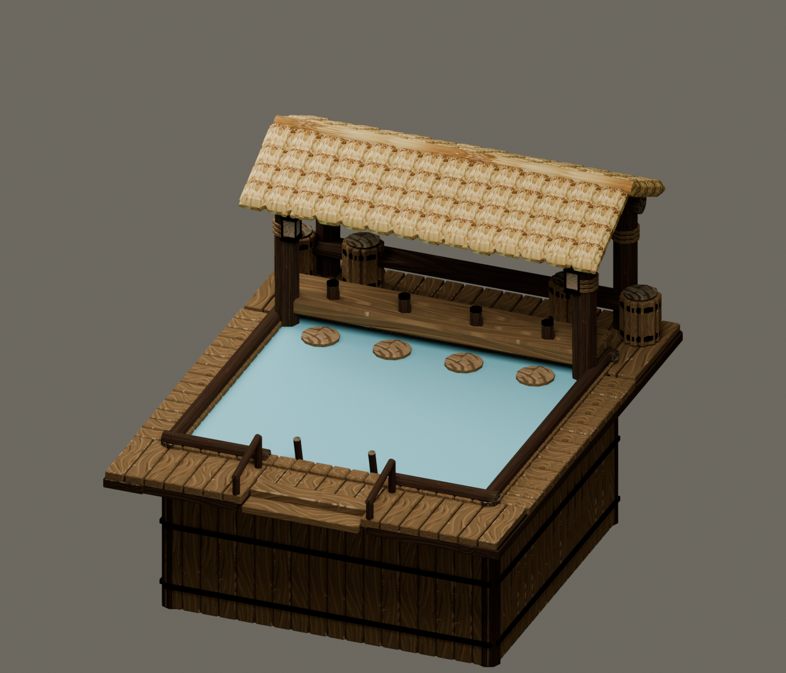

# The Tipsy Tail

A swim-up pool bar for **Timberborn**, built from timber and thatch. Eight beavers unwind at once, and haulers keep it filled with water.

**[Download v1.0.1](https://github.com/timbermods/timberborn-tipsy-tail/releases/download/v1.0.1/TipsyTail-v1.0.1-mod.zip) · [Project website](https://timbermods.github.io/timberborn-tipsy-tail/) · [Report a bug](https://github.com/timbermods/timberborn-tipsy-tail/issues/new/choose)** <!-- latest -->

*Model render with approximate water. In game the basin is buried.*

## What it does

- Eight beavers at once: four on bar seats, four in swimming lanes.
- Relieves its own need, the Tipsy Tail, in Social Life: 0.6 an hour, worth up to +2 well-being.
- Relieves the game's Wet fur need at 0.5 an hour, the same as the Lido and Swimming Pool.
- Haulers bring water. It holds 60 and uses 12 a day while open, even with nobody in it.
- When it runs dry, both needs stop and the water vanishes until haulers refill it.
- The pool is drawn with the game's own lake water.
- Folktails and Iron Teeth, under **Well-being**.

It adds to a Lido or Swimming Pool rather than replacing it.

## What it needs

| Requirement | Value |
| --- | --- |
| Site | 5 × 6, level ground |
| Ground | Two solid soil layers below. Platforms and pre-dug pits don't qualify. |
| Clearance | Three blocks above ground |
| Build | 60 logs, 40 planks, 10 gears |
| Unlock | 500 science |
| Supply | A path to the front entrance, and a staffed Hauling Post with access to water |

No workers, no power and no other mods. Demolishing it brings the original ground back.

## Install

1. Close Timberborn.
2. Download **TipsyTail-v1.0.1-mod.zip** under **Assets** on the [release page](https://github.com/timbermods/timberborn-tipsy-tail/releases/tag/v1.0.1), not "Source code". <!-- latest -->
3. Extract the **TipsyTail** folder into `Documents\Timberborn\Mods`. `manifest.json` must sit directly in `Mods\TipsyTail`.
4. Enable **The Tipsy Tail** in the mod manager and restart when asked.

**Updating:** close the game and replace the old `TipsyTail` folder with the new one. Keep only one version installed. Saves load unchanged.

**Multiplayer:** every player needs the same mod version and the same game version.

## What's new in v1.0.1

The optional `water.cfg` is read from whatever folder the game loaded the mod from, even a renamed one. Gameplay, saves and multiplayer are unchanged. Every version's changes are in [CHANGELOG.md](CHANGELOG.md).

## Release status

**v1.0.1 is a maintenance release of the first full release, for Timberborn 1.1.2.4.**

**Tested:**

- Earlier builds were played in game, including multiplayer with every player on the same version.
- The recreation, Wet fur and water-supply wiring was checked against the game's own code.
- Offline checks against the game's own files cover the model, blueprints, materials, geometry, Wet fur, the terrain cutout and the water data.

**Not confirmed in game yet:**

- The pool's lake-water look.
- Swimmers sitting at the water surface. Worth a glance in your own colony.
- An optional `water.cfg` in a renamed mod folder (proven outside the game).
- Pools placed with the very first builds, on thin ground or platforms, may need rebuilding.
- Game versions other than 1.1.2.4.

Please report anything odd with a screenshot and your `Player.log`.

## If the pool water looks wrong

The pool uses the game's own water, so there is nothing to tune. If it doesn't look right on your machine:

1. Download **TipsyTail-v…-water-presets.zip** under **Assets** on the [release page](https://github.com/timbermods/timberborn-tipsy-tail/releases/latest).
2. Copy one preset into the mod folder, next to `manifest.json`, and rename it `water.cfg`:
   - `1-game-water.cfg`: the default water. It also writes the pool's values to `Player.log`.
   - `2-legacy-ripples.cfg`: an older, hand-tuned look.
   - `3-vanilla-fountain-water.cfg`: the game's untouched fountain water.
3. Wait a few seconds; no restart is needed. Delete the file to go back to the default.

The file only changes how the pool looks, never gameplay or multiplayer. Please [report the problem](#reporting-a-problem) too.

## Reporting a problem

[Open an issue](https://github.com/timbermods/timberborn-tipsy-tail/issues/new/choose) and fill in the form. Attach a screenshot and any error from `Player.log`. On Windows it's in `%USERPROFILE%\AppData\LocalLow\Mechanistry\Timberborn`. Remove personal information before posting.

To build the mod from source, see [DEVELOPMENT.md](DEVELOPMENT.md).

## Credits and license

Maintained by [Timbermods](https://github.com/timbermods). [More mods from Timbermods](https://timbermods.github.io/).

An unofficial community mod for Timberborn. Not affiliated with or endorsed by Mechanistry. The original project files are MIT licensed (see [LICENSE](LICENSE)); Timberborn and its game assets belong to Mechanistry and are not covered. See [CREDITS.md](CREDITS.md).
